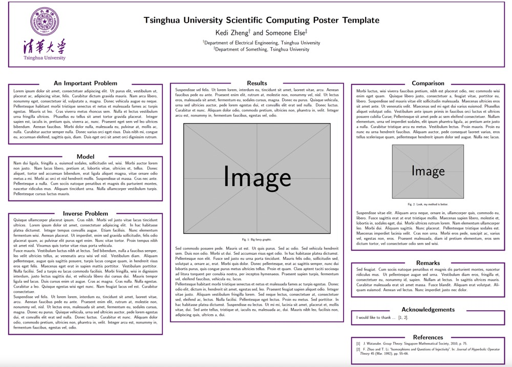

# Tsinghua University LaTeX Poster Template

This LaTeX poster template requires the `tikzposter` document class and is modified from [Emory College's poster template](https://www.overleaf.com/latex/templates/emory-poster-template/skpfmpxjnqdh) and [University of Oregon's poster template](https://github.com/ZaydH/uo_poster_template). The color scheme and logo are from the  [Visual Identity System Guidelines of Tsinghua University](http://info.tsinghua.edu.cn/html/lmntw/file/VisualIdentity-app-en-1.pdf). 

It is built on `latexmk`, one can use the following command to compile with TexLive:

```bash
latexmk
latexmk -c
```

**Note**: This template is *not* officially sanctioned by Tsinghua University.  The template is provided in case it is useful to other students.  


